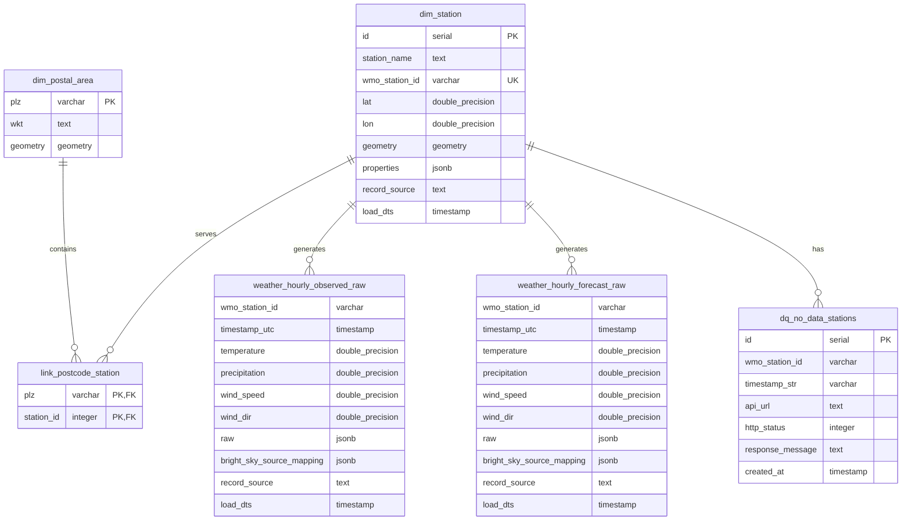

# Weather Observations and Forecasting System

A comprehensive weather data ingestion and processing system that collects, stores, and processes weather observations and forecasts from multiple sources, with spatial aggregation capabilities for postal code areas.

## 🚀 Quick Start

**For new users**: See [README_SETUP.md](README_SETUP.md) for a complete setup guide.

**One-command setup**:
```bash
./setup.sh
```

**Access Airflow**: http://localhost:8080 (admin/admin)

## Overview

This system ingests weather data from the BrightSky API, processes it through data quality checks, and stores it in a PostgreSQL database with PostGIS spatial extensions. The system supports both historical observations and weather forecasts, with spatial relationships between weather stations and postal code areas.

**🎯 Quick Start**: Use the included Makefile for easy project management - run `make help` to see all available commands!

## Database Schema

### Entity Relationship Diagram



## Table Descriptions

### Dimension Tables

#### `dim_postal_area`
- **Purpose**: Stores German postal code boundaries as spatial polygons
- **Key Fields**:
  - `plz`: Postal code (Primary Key)
  - `wkt`: Well-Known Text representation of geometry
  - `geometry`: PostGIS MULTIPOLYGON geometry (SRID 4326)
- **Indexes**: GIST index on geometry for spatial queries

#### `dim_station`
- **Purpose**: Weather station metadata and locations
- **Key Fields**:
  - `id`: Auto-incrementing primary key
  - `wmo_station_id`: WMO station identifier (Unique)
  - `station_name`: Human-readable station name
  - `lat/lon`: Geographic coordinates
  - `geometry`: PostGIS POINT geometry (SRID 4326)
  - `properties`: JSONB field for additional station metadata
- **Indexes**: GIST index on geometry for spatial operations

### Link Table

#### `link_postcode_station`
- **Purpose**: Many-to-many relationship between postal codes and weather stations
- **Key Fields**:
  - `plz`: Postal code (Foreign Key to dim_postal_area)
  - `station_id`: Station identifier (Foreign Key to dim_station)
- **Business Logic**: Created through spatial intersection of station points with postal area polygons

### Fact Tables (Raw Data)

#### `weather_hourly_observed_raw`
- **Purpose**: Raw historical weather observations from BrightSky API
- **Key Fields**:
  - `wmo_station_id`: Station identifier
  - `timestamp_utc`: Observation timestamp
  - `temperature`, `precipitation`, `wind_speed`, `wind_dir`: Core weather measurements
  - `raw`: Complete JSON response from API
  - `bright_sky_source_mapping`: Source metadata
- **Indexes**: Composite index on (wmo_station_id, timestamp_utc) and load_dts

#### `weather_hourly_forecast_raw`
- **Purpose**: Raw weather forecasts from BrightSky API
- **Key Fields**: Same structure as observed data
- **Indexes**: Composite index on (wmo_station_id, timestamp_utc) and load_dts

### Data Quality Tables

#### `dq_no_data_stations`
- **Purpose**: Logs API calls that returned no data (404 errors)
- **Key Fields**:
  - `wmo_station_id`: Station identifier
  - `api_url`: URL that returned no data
  - `http_status`: HTTP status code
  - `response_message`: API response details

## System Architecture

### Architecture Philosophy
This system uses a **functional programming approach** which is ideal for data pipelines because:
- **Linear workflow**: Clear data flow from ingestion → transformation → aggregation
- **Stateless operations**: Each function processes data independently
- **Easy testing**: Functions can be tested in isolation
- **Simple debugging**: Clear function boundaries and data flow
- **Maintainable**: Modular design with reusable components

### Data Flow
1. **Ingestion**: Raw data from BrightSky API → Raw fact tables
2. **Spatial Processing**: Station locations → Postal code assignments  
3. **Quality Control**: Data validation → DQ tables for error tracking
4. **Transformation**: Raw data → Clean, standardized data per postal code
5. **Aggregation**: Standardized data → ML-ready aggregated data per postal code

### Key Features
- **Spatial Operations**: PostGIS for geographic calculations
- **Data Quality**: Comprehensive validation and error logging
- **Scalability**: Batch processing with concurrent API calls
- **Audit Trail**: Complete data lineage tracking
- **Flexibility**: JSONB fields for extensible metadata
- **Incremental Processing**: Only processes new data for efficiency
- **Materialized Views**: Pre-computed aggregations for fast queries

## Usage

### Prerequisites
- PostgreSQL with PostGIS extension
- Python 3.11+
- Docker and Docker Compose (for development)

### Quick Start with Makefile (Recommended)

The project includes a comprehensive Makefile for easy management with 30+ commands covering all operations:

```bash
# Show all available commands
make help

# Initial setup
make setup

# Quick start options
make quick-start      # Start main services
make quick-airflow    # Start with Airflow orchestration

# Check system status
make health
```

> 📋 **See [Makefile Commands](#makefile-commands) section below for complete documentation**

### Setup Options

#### Option 1: Simple Python Script (Original)
```bash
make setup           # Initial setup
make start           # Start PostgreSQL
make run-ingestion   # Run data ingestion
```

#### Option 2: Airflow Orchestration (Recommended)
```bash
make setup           # Initial setup
make quick-airflow   # Start PostgreSQL + Airflow
# Access Airflow Web UI at http://localhost:8080 (admin/admin)
# Run the weather_onetime_setup DAG first (manual trigger)
# The weather_hourly_ingestion DAG will run automatically every hour
```

## Makefile Commands

The project includes a comprehensive Makefile that provides simple commands for all operations. This eliminates the need to remember complex Docker Compose commands and provides a consistent interface across different environments.

### Quick Reference

| Command | Description |
|---------|-------------|
| `make help` | Show all available commands |
| `make setup` | Initial project setup |
| `make start` | Start main services |
| `make stop` | Stop main services |
| `make status` | Show service status |
| `make logs` | View service logs |
| `make run-ingestion` | Run data ingestion |
| `make airflow-start` | Start Airflow orchestration |
| `make airflow-stop` | Stop Airflow orchestration |
| `make airflow-status` | Show Airflow status |
| `make test` | Run Python unit tests |
| `make dbt-test` | Run dbt tests |
| `make dbt-run` | Run dbt models |
| `make health` | System health check |
| `make clean` | Clean up everything |

### Detailed Command Reference

#### 🏗️ Setup & Installation Commands

| Command | Description | Usage |
|---------|-------------|-------|
| `make setup` | Initial project setup with prerequisite checks | `make setup` |
| `make install` | Install Python dependencies from requirements.txt | `make install` |
| `make dev-setup` | Setup development environment | `make dev-setup` |
| `make env-check` | Check environment configuration | `make env-check` |

#### 🚀 Main Services Commands

| Command | Description | Usage |
|---------|-------------|-------|
| `make start` | Start PostgreSQL and main services | `make start` |
| `make stop` | Stop all main services | `make stop` |
| `make restart` | Restart main services | `make restart` |
| `make status` | Show status of main services | `make status` |
| `make logs` | Show logs from main services | `make logs` |

#### 🔄 Data Operations Commands

| Command | Description | Usage |
|---------|-------------|-------|
| `make run-ingestion` | Run the main Python ingestion script | `make run-ingestion` |
| `make dbt-run` | Run dbt models to process data | `make dbt-run` |
| `make dbt-test` | Run dbt tests for data quality | `make dbt-test` |
| `make dbt-build` | Run dbt build (models + tests) | `make dbt-build` |

#### ☁️ Airflow Orchestration Commands

| Command | Description | Usage |
|---------|-------------|-------|
| `make airflow-start` | Start Airflow orchestration | `make airflow-start` |
| `make airflow-stop` | Stop Airflow orchestration | `make airflow-stop` |
| `make airflow-status` | Show Airflow service status | `make airflow-status` |
| `make airflow-logs` | Show Airflow logs | `make airflow-logs` |
| `make airflow-restart` | Restart Airflow services | `make airflow-restart` |

#### 🗄️ Database Operations Commands

| Command | Description | Usage |
|---------|-------------|-------|
| `make db-connect` | Connect to PostgreSQL database | `make db-connect` |
| `make db-backup` | Create database backup | `make db-backup` |
| `make db-restore` | Restore database from backup | `make db-restore BACKUP=backup_file.sql` |

#### 🧪 Testing & Quality Commands

| Command | Description | Usage |
|---------|-------------|-------|
| `make test` | Run Python unit tests | `make test` |
| `make lint` | Run code linting | `make lint` |
| `make format` | Format Python code | `make format` |

#### 🔧 Development & Monitoring Commands

| Command | Description | Usage |
|---------|-------------|-------|
| `make health` | Check system health and service status | `make health` |
| `make version` | Show project version and system info | `make version` |
| `make docs` | Show project documentation | `make docs` |

#### 🧹 Cleanup Commands

| Command | Description | Usage |
|---------|-------------|-------|
| `make clean` | Clean up containers, volumes, and temporary files | `make clean` |
| `make clean-logs` | Clean up log files | `make clean-logs` |
| `make full-reset` | Full system reset (stops everything, cleans up, and restarts) | `make full-reset` |

#### ⚡ Quick Workflow Commands

| Command | Description | Usage |
|---------|-------------|-------|
| `make quick-start` | Quick start with main services | `make quick-start` |
| `make quick-airflow` | Quick start with Airflow orchestration | `make quick-airflow` |

### Common Workflows

#### 🚀 Getting Started (First Time)
```bash
# 1. Initial setup
make setup

# 2. Choose your approach:
# Option A: Simple Python script
make quick-start
make run-ingestion

# Option B: Airflow orchestration (recommended)
make quick-airflow
# Then access http://localhost:8080 and run the onetime setup DAG
```

#### 🔄 Daily Operations
```bash
# Check system health
make health

# View logs
make logs

# Check Airflow status (if using Airflow)
make airflow-status
```

#### 🧪 Development Workflow
```bash
# Run tests
make test
make dbt-test

# Run data processing
make dbt-run

# Check everything is working
make health
```

#### 🗄️ Database Management
```bash
# Create backup
make db-backup

# Connect to database
make db-connect

# Restore from backup
make db-restore BACKUP=backups/backup_20241201_120000.sql
```

#### 🧹 Maintenance
```bash
# Clean up everything
make clean

# Full system reset
make full-reset

# Clean just logs
make clean-logs
```

### Makefile Features

- **Smart Prerequisites Checking**: Automatically validates Docker, Docker Compose, and environment setup
- **Environment Integration**: Reads configuration from `.env` file automatically
- **Error Handling**: Provides clear error messages and validation
- **Cross-Platform**: Works on Linux, macOS, and Windows (with Make installed)
- **Comprehensive Coverage**: All project operations accessible through simple commands
- **Help System**: Built-in help with `make help` command
- **Consistent Interface**: Same commands work regardless of underlying Docker Compose complexity

### Prerequisites for Makefile

- **Make**: Available on most Unix-like systems (Linux, macOS)
- **Docker**: Required for containerized services
- **Docker Compose**: Required for multi-container orchestration
- **Python 3.11+**: Required for Python operations

### Getting Help

```bash
# Show all available commands
make help

# Show version and system info
make version

# Check environment configuration
make env-check

# Check system health
make health
```

### Airflow Orchestration

The Airflow setup provides better orchestration, monitoring, and error handling:

- **Web UI**: Visual DAG monitoring and task management
- **Scheduling**: Automatic hourly execution at the 1st minute of each hour
- **Error Handling**: Retry logic and failure notifications
- **Logging**: Centralized task logs and execution history
- **Dependencies**: Proper task dependencies and parallel execution

See `airflow/README.md` for detailed Airflow setup instructions.

### Configuration
Key configuration variables in `utils/config.py`:
- `BRIGHTSKY_BASE`: BrightSky API base URL
- `HTTP_CONCURRENCY`: Number of concurrent API calls
- `FORECAST_DAYS_BY`: Number of forecast days to ingest
- `DEFAULT_COUNTRY`: Target country for data processing

## Data Quality

The system implements comprehensive data quality measures:
- **Validation Rules**: Temperature, pressure, humidity, wind speed/direction ranges
- **Outlier Detection**: Statistical validation of weather parameters
- **Missing Data Handling**: Logging and flagging of incomplete records
- **API Error Handling**: Graceful handling of API failures and timeouts
- **Audit Logging**: Complete tracking of data processing steps

## Future Enhancements

### Planned Features
1. **Data Transformation Pipeline**: Clean, aggregated data per postal code
2. **ML-Ready Datasets**: Feature engineering for machine learning
3. **Real-time Processing**: Stream processing for live data updates
4. **Advanced Analytics**: Weather pattern analysis and forecasting
5. **API Endpoints**: REST API for data access

### Data Transformation Pipeline
The next phase will include:
- **Data Cleaning**: Outlier detection and correction
- **Feature Engineering**: Derived weather metrics and trends
- **Spatial Aggregation**: Postal code-level weather summaries
- **ML Features**: Time series features for predictive modeling

## Testing

The project includes comprehensive testing at multiple levels:

### **Python Unit Tests** (`ingestion_tests/`)
- **Ingestion Tests**: API integration and data validation
- **Transformation Tests**: Data cleaning and processing logic
- **Integration Tests**: End-to-end workflow validation
- **Utility Tests**: Helper functions and configurations

```bash
# Run all Python tests
python -m pytest ingestion_tests/

# Run specific test categories
python -m pytest ingestion_tests/test_ingestion.py
python -m pytest ingestion_tests/test_transformation.py
```

### **dbt Model Tests** (`tests/`)
- **Data Quality Tests**: Range validations, null checks, format validations
- **Business Logic Tests**: Outlier detection, confidence scoring, spatial linking
- **Integration Tests**: Cross-model data integrity, referential integrity
- **Custom Tests**: Weather-specific data quality validations

```bash
# Run all dbt tests
dbt test

# Run tests by category
dbt test --select staging
dbt test --select marts
dbt test --select test_type:custom
```

### **Test Documentation**
- **Python Tests**: See `ingestion_tests/README.md`
- **dbt Tests**: See `tests/README.md`

## Contributing

1. Fork the repository
2. Create a feature branch
3. Make your changes
4. Add tests for new functionality (both Python and dbt tests)
5. Run the test suite to ensure everything passes
6. Submit a pull request

## License

This project is licensed under the MIT License - see the LICENSE file for details.
