# Weather Observations and Forecasting System

## 1. Introduction

This project is a comprehensive weather data ingestion and processing system that collects, stores, and processes weather observations and forecasts from multiple sources. The system implements a modern data warehouse architecture with spatial aggregation capabilities for postal code areas.

### Key Features
- **Fresh Weather Data**: Ingests hourly weather observations and forecasts from the BrightSky API
- **Spatial Processing**: Links weather stations to German postal code areas using PostGIS
- **Data Quality**: Implements comprehensive validation, outlier detection, and confidence scoring
- **Modern Architecture**: Follows medallion architecture (Bronze, Silver, Gold layers) with dbt transformations
- **Orchestration**: Uses Apache Airflow for workflow management and scheduling
- **Scalable Design**: Built with Docker containers for easy deployment and scaling

### Business Value
- Provides weather data at postal code level for location-based services
- Enables weather pattern analysis and forecasting capabilities
- Supports data-driven decision making for weather-dependent businesses
- Offers clean, validated data ready for Machine Learning applications

## 2. How to Run

### Prerequisites
- Docker and Docker Compose installed
- Make utility (available on most Unix-like systems)
- At least 4GB RAM and 10GB disk space

### Quick Start

1. **Clone the repository**
   ```bash
   git clone <repository-url>
   cd weather-observations-and-forecasting
   ```

2. **Start the system**
   ```bash
   make start
   ```
   This command automatically runs the startup process twice with proper timing to ensure all services initialize correctly.

3. **Access the system**
   - **Airflow Web UI**: http://localhost:8080 (username: `admin`, password: `admin`)
   - **PostgreSQL Database**: localhost:5432 (database: `weatherdb`)
   - If you wish to connect to Postgres via CLI, run: `docker exec -it weather_postgis psql -U postgres -d weatherdb`

4. **Run the data pipeline**
   - In Airflow UI, find and trigger the `weather_onetime_setup` DAG first
   - The `weather_hourly_ingestion` DAG will run automatically every hour

### Available Commands

| Command | Description |
|---------|-------------|
| `make start` | Start the complete system (runs twice for proper initialization) |
| `make stop` | Stop all services |
| `make status` | Show service status |
| `make logs` | View service logs |
| `make clean` | Clean up everything for fresh start |

### First Run Notes
- The first DAG run may take several minutes as it downloads German postal area data (~12MB)
- This is a one-time operation - subsequent runs will be much faster
- The system automatically handles initialization and service dependencies

## 3. Data Flow

The system follows a modern data warehouse architecture with clear separation of concerns across multiple layers:

### Architecture Overview

```mermaid
graph LR
    %% External Sources (Bronze)
    subgraph "🌐 SOURCES"
        A[BrightSky API]
        E[TopoJSON Source]
    end
    
    %% Raw Layer (Bronze)
    subgraph "🥉 RAW LAYER (Bronze)"
        B[weather_hourly_observed_raw]
        C[weather_hourly_forecast_raw]
        D[station_raw]
        F[postal_area_raw]
    end
    
    %% Staging Layer (Silver)
    subgraph "🥈 STAGING LAYER (Silver)"
        G[stg_weather_observed_hourly]
        H[stg_weather_forecast_hourly]
        I[stg_dim_station]
        J[stg_dim_postal_area]
    end
    
    %% Dimensions Layer (Gold)
    subgraph "🥇 DIMENSIONS LAYER (Gold)"
        K[dim_station]
        L[dim_postal_area]
    end
    
    %% Facts Layer (Gold)
    subgraph "🥇 FACTS LAYER (Gold)"
        M[fact_link_postcode_station]
        N[fact_weather_observed_hourly]
        O[fact_weather_forecast_hourly]
    end
    
    %% Marts Layer (Gold)
    subgraph "🥇 MARTS LAYER (Gold)"
        P[mart_weather_forecast_hourly_aggregated]
        Q[mart_weather_observed_hourly_aggregated]
    end
    
    %% Flow connections
    A --> B
    A --> C
    A --> D
    E --> F
    
    B --> G
    C --> H
    D --> I
    F --> J
    
    I --> K
    J --> L
    
    K --> M
    L --> M
    
    G --> N
    H --> O
    K --> N
    K --> O
    L --> N
    L --> O
    M --> N
    M --> O
    
    O --> P
    N --> Q
```



### Data Processing Pipeline

1. **Ingestion (Bronze Layer)**
   - Raw weather data from BrightSky API
   - German postal area boundaries from TopoJSON
   - Data stored as-is with minimal processing

2. **Staging (Silver Layer)**
   - Data cleaning and standardization
   - Outlier detection and confidence scoring
   - Geometry creation for spatial data
   - Deduplication by business keys

3. **Dimensions (Gold Layer) - Currently in SCD Type 1**
   - Master reference data for stations and postal areas
   - Surrogate key generation
   - Proper indexing for performance

4. **Facts (Gold Layer) - Currently in SCD Type 1**
   - Spatial linking between postal areas and stations
   - Weather data enriched with dimension attributes
   - PostGIS distance calculations

5. **Marts (Gold Layer) - Currently in SCD Type 1**
   - Postal code level aggregations
   - Statistical summaries and data quality metrics
   - Business-ready datasets

### Implementation Summary

The system processes weather data through a comprehensive pipeline starting with API ingestion into the raw layer where data is stored as-is. The staging layer (curation layer) performs deduplication and data cleaning, including outlier detection for all weather properties. Outliers are replaced with null values and flagged for easy data quality filtering. The implementation focuses on Berlin weather stations to maintain manageable data volumes and fast pipeline execution. The data is modeled using a star schema with fact tables containing all required information, including both foreign keys and business keys to support both ML and analytical use cases. Finally, the data is aggregated by postal code on an hourly basis with pre-computed statistical summaries (min, max, avg) for all weather attributes to optimize ML workflow performance.

### Orchestration
- **Apache Airflow**: Manages the entire data pipeline
- **Scheduling**: Automatic hourly execution at the 1st minute of each hour
- **Monitoring**: Web UI for task monitoring and error handling
- **Dependencies**: Proper task dependencies and parallel execution

## 4. ER Diagram

The system implements a comprehensive data model with clear relationships between weather data, stations, and postal areas:


## 5. Description about Data Flow

### Technology Choices and Architecture Decisions

#### **Python for Raw Layer Processing**
Python was chosen for the raw data ingestion layer due to several key advantages:

- **API Integration**: Excellent libraries (`requests`, `aiohttp`) for efficient API consumption
- **Spatial Processing**: Robust geospatial libraries (`geopandas`, `shapely`) for handling TopoJSON and spatial operations
- **Data Validation**: Rich ecosystem for data quality checks and outlier detection
- **Flexibility**: Easy to implement custom business logic and error handling
- **Rapid Development**: Quick prototyping and iteration for data ingestion patterns
- **Functional Programming Approach**: Chosen over object-oriented programming since each data entity (weather observations, forecasts, stations, postal areas) operates independently without complex object relationships, making functional programming more suitable for data processing pipelines

#### **dbt for Transformation Layers**
dbt was selected for staging, dimensions, facts, and marts layers because:

- **SQL-First Approach**: Leverages existing SQL skills and database optimization
- **Version Control**: Git-based workflow for data transformations
- **Testing Framework**: Built-in data quality testing and validation
- **Documentation**: Auto-generated documentation and lineage tracking
- **Modularity**: Reusable models and macros for consistent transformations
- **Database Optimization**: Pushes computation to the database engine (PostgreSQL/PostGIS)

### Production Scaling Architecture

For enterprise-scale deployments, the architecture can be enhanced with:

**Data Lake Integration**: PostgreSQL → Kafka CDC → Data Lake (S3/GCS) → Data Warehouse
- Real-time streaming with Kafka CDC for database changes
- Cost-effective storage with S3/GCS using Parquet format and open table formats (Iceberg/Delta)

**Enhanced Medallion Architecture**: Raw Layer (Bronze) → Staging Layer (Silver) → Analytics Layer (Gold)
- Raw Layer: S3 Parquet files with AWS Glue catalog (or BigQuery external tables)
- Staging Layer: dbt on Spark (EMR on EKS) or dbt on Snowflake/BigQuery compute
- Analytics Layer: AWS Glue tables/Redshift Spectrum or native data warehouse tables
- Orchestration: Airflow on Kubernetes with cloud-native operators

**Data Quality and Governance**: SODA Framework → Prometheus Metrics → Grafana Dashboards → Alerting
- Data contracts with schema validation and quality gates
- Automated data quality checks across all layers
- Complete observability with Prometheus metrics and Grafana dashboards

**Production Deployment**: Kubernetes orchestration with Apache Spark for distributed processing
- Container orchestration for scalability
- Storage and compute separation for cost efficiency
- Stream processing with Kafka Streams or Apache Flink for real-time data

### Current vs. Production Architecture

| Component | Current (Development) | Production (Scalable) |
|-----------|----------------------|----------------------|
| **Storage** | PostgreSQL | Data Lake (S3/GCS) + Data Warehouse |
| **Processing** | Python + dbt | Spark + dbt on Spark |
| **Orchestration** | Airflow (Docker) | Airflow on Kubernetes |
| **Monitoring** | Basic logging | Prometheus + Grafana |
| **Data Quality** | dbt tests | SODA + Data Contracts |
| **CDC** | Manual refresh | Kafka CDC |
| **Scalability** | Single instance | Auto-scaling clusters |

## AI-Assisted Development

This project demonstrates the effective collaboration between human expertise and AI assistance in modern data engineering. The development process leveraged AI capabilities while maintaining human oversight and domain knowledge.

### AI Contributions

**Code Generation and Architecture Design**
- AI assisted in generating boilerplate code for data ingestion scripts, dbt models, and Airflow DAGs
- Generated comprehensive test cases for both Python unit tests and dbt model tests
- Created Docker configurations and orchestration scripts

**Documentation and Knowledge Transfer**
- AI generated detailed README sections, technical documentation, and code comments
- Created visual diagrams (Mermaid) for data flow and ER diagrams
- Assisted in writing comprehensive test documentation and setup guides
- Generated production scaling recommendations and technology stack comparisons

**Problem Solving and Debugging**
- AI helped troubleshoot Docker container issues, dependency conflicts, and configuration problems
- Assisted in resolving dbt model errors, SQL syntax issues, and data quality test failures
- Provided solutions for Airflow orchestration challenges and service dependency management
- Helped optimize database queries and performance tuning

### Human Expertise and Oversight

**Domain Knowledge and Business Logic**
- Human expertise defined the weather data requirements, spatial processing needs, and business rules
- Determined the scope (Berlin weather stations) and data quality thresholds
- Made architectural decisions about technology choices (Python vs. other languages, dbt vs. other tools)
- Defined the star schema design and fact/dimension relationships

**Strategic Decision Making**
- Chose functional programming over object-oriented approach based on data entity independence
- Decided on the medallion architecture and layer separation strategy
- Made production scaling decisions and technology stack selections
- Defined the testing strategy and data quality framework

**Code Review and Quality Assurance**
- Human review ensured all AI-generated code met business requirements and best practices
- Validated that architectural decisions aligned with project goals and constraints
- Ensured proper error handling, logging, and monitoring implementation
- Verified that the system met performance and scalability requirements

This collaborative approach demonstrates how AI can enhance developer productivity while maintaining the critical human judgment needed for complex data engineering projects.